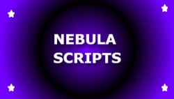

<p align="center">
    
</p>   

# NEBULA SCRIPTS

> Nebula scripts is a wide variety of open-source programs which execute specific commands in roblox games
## 🚀 Quick Start
```lua
loadstring("https://raw.githubusercontent.com/Cooldudeisbetter/nebulascripts/refs/heads/main/hub.lua")
```

## 💪 Advantages of Nebula

1. **Fast**
2. **Reliable**
3. **Effective**

## 🛠️ Advanced Setup

> Nebula Scripts lists all scripts publicly.Select them and execute them manually.
### Find Nebula Scripts at [Scripts](https://github.com/Cooldudeisbetter/nebulascripts/tree/main/scripts "Nebula Independent Scripts")

## 🖐 Credits

- [WindUi](https://github.com/Footagesus/WindUI)
- [Cobalt](https://github.com/notpoiu/cobalt)
